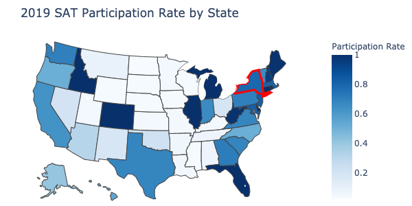
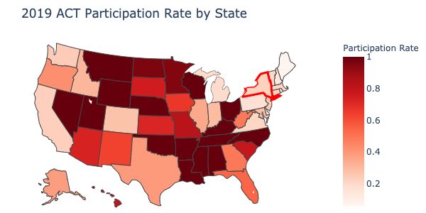
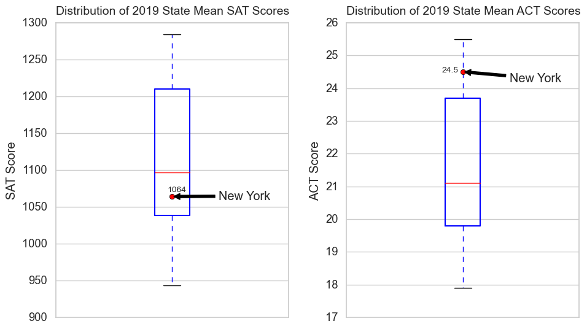
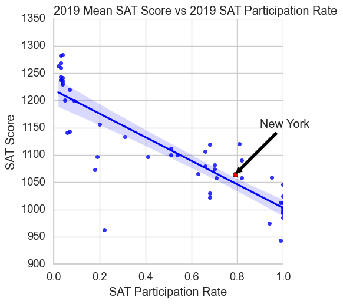
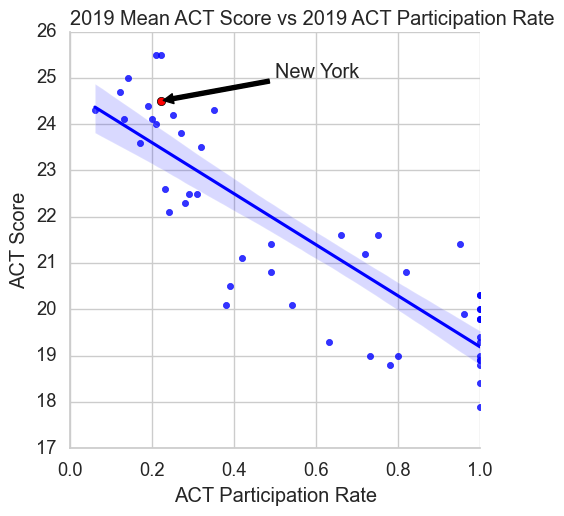
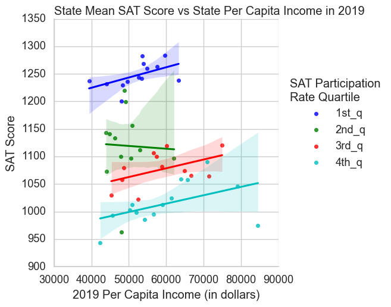
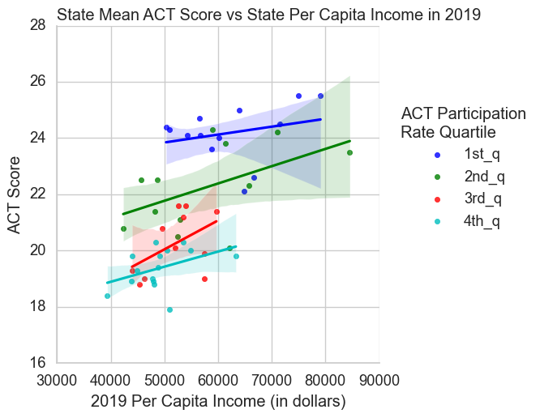
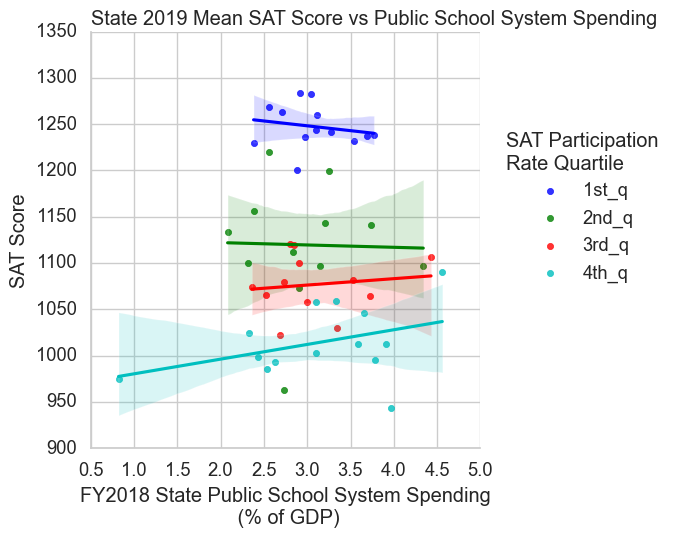
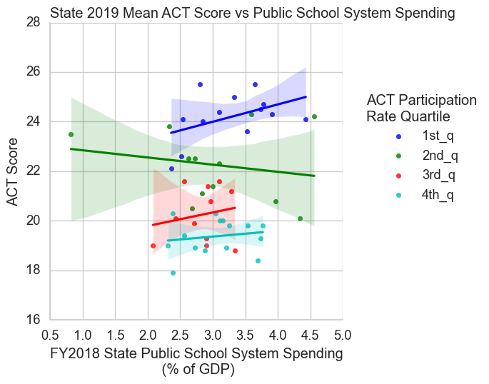

## Project 1 - Standardised Test Analysis 
### Analysis of predictor variables on standardised test scores across US States
---

## Executive Summary 

This paper compares 2019 mean SAT and ACT scores across the 50 states and the District of Columbia in order to benchmark the performance of New York state. It also examines how test participation rates, income levels and state education spending relate to standardised test scores in the US. 

The analysis finds that students in New York state largely perform better than students in other states, after accounting for the impact of test participation rate on scores. This may be due to the high personal income per capita of New York state which appears to have a non-trival positive correlation with test scores. In contrast, there is weak to no evidence for a correlation between education spending and test scores. Based on this, the paper recommends not to increase state education spending wholesale.  

---

## Problem Statement

The Commissioner of the New York State Education Department would like to understand how the state fares in its education outcomes as measured by SAT/ACT scores, and if the state should increase its public school system spending in order to improve students' performance in the examinations.

 

## Datasets Used

I used two provided datasets: 

* [`sat_2019.csv`](./data/sat_2019.csv): 2019 SAT Scores by State ([source](https://blog.prepscholar.com/average-sat-scores-by-state-most-recent))
* [`act_2019.csv`](./data/act_2019.csv): 2019 ACT Scores by State ([source](https://blog.prepscholar.com/act-scores-by-state-averages-highs-and-lows))

I also extracted the following datasets from public domain sources:

*  [`ed_spending_by_state.csv`](./data/ed_spending_by_state.csv): FY2018 Public Elementary-Secondary Education Finance data from census.gov ([source](
https://www.census.gov/data/tables/2018/econ/school-finances/secondary-education-finance.html))

* [`SAGDP1__ALL_AREAS_1997_2019.csv`](./data/SAGDP1__ALL_AREAS_1997_2019.csv): 2019 State GDP data from U.S. Bureau of Economic Analysis ([source](
https://apps.bea.gov/regional/histdata/releases/0420gdpstate/index.cfm))

* [`SAINC1__ALL_AREAS_1929_2019.csv`](./data/SAINC1__ALL_AREAS_1929_2019.csv): 2019 State Per Capita Personal Income data from U.S. Bureau of Economic Analysis. ([source](
https://apps.bea.gov/regional/histdata/releases/0320spi/index.cfm))

 

## Cleaned Dataset and Data Dictionary
[`score2019.csv`](project_1/data/score2019.csv)

|Feature|Type|Dataset|Description|
|---|---|---|---|
|state|object|SAT|The name of the US state| 
|sat_participate|float|SAT|The participation rate of students in the state taking the SAT as a decimal|
|sat_ebrw|integer|SAT|The mean score of students in the state on the Evidence-Based Reading & Writing section of the SAT|
|sat_math|integer|SAT|The mean score of students in the state on the Math section of the SAT|
|sat_score|integer|SAT|The mean score of students in the state on the SAT|
|act_participate|float|ACT|The participation rate of students in the state taking the ACT as a decimal|
|act_score|float|ACT|The mean score of students in the state on the ACT|
|eduspend|float|2018 Public Elementary-Secondary Education Finance Data|The amount of state public school system spending in FY2018 in thousands of dollars|
|gdp2019|float|Gross Domestic Product by State, Fourth Quarter and Annual 2019|State Gross Domestic Product in 2019 in thousands of 2019 dollars|
|pci2019|float|State Personal Income: Preliminary estimates for 2019|Per Capita Personal Income by State in dollars 
|normeduspend|float|NA|State public school system spending in FY2018 as a percentage of state GDP

 

## Findings

### Rank of Test Scores and Test Participation Rate for New York state

New York students tend to prefer the SATs over the ACTs, similar to other states in the Northeastern Seaboard.

Mean test scores for New York are below the median for SAT and above the 75th percentile for ACT when comparing across states. This makes sense as students in New York would only take the ACTs if they are reasonably confident of getting a good score. This selection bias results in a strong negative correlation between participation rate and test score. 

### Performance of New York state

After controlling for participation rate, New York state performs better in both SAT and ACT compared to other states on average (i.e. above the trend line) 

### Effect of Per Capita Income and State Education Spending on Test Scores

To strip out the effect of participation rate, the analysis grouped states into 4 buckets based on their participation rate. With the exception of 1 bucket, there seems to be a positive relationship between per capita income and test scores, as one would intuitively expect. 

One of the reasons why New York state performs better could be due to its high per capita income (ranked 4th out of 51 states and jurisidctions). 

However, the evidence for a relationship between test score and public school system spending is weak. In some buckets, increased spending on education actually led to decreased test scores.

 

## Recommendations
* Relative to other states, students in New York state are performing moderately well in its ACT and SAT exams. Existing efforts seem to be adequate and should be continued.
* There is no evidence that increasing public school system spending leads to an increase in test scores. Instead of increasing spending wholesale, the study recommends for the Commissioner to examine the influence of other factors such as the allocation of spending or class sizes, in order to see if there are more effective levers to improve student outcomes. 

